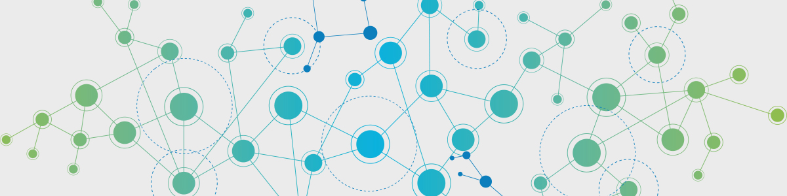

<html lang="en">
<head>
  <meta charset="UTF-8">
  <meta name="viewport" content="width=device-width, initial-scale=1.0">
  <meta http-equiv="X-UA-Compatible" content="ie=edge">
  <title>J.Wilson CIT</title>
</head>
<body>
  <h2>CIT Minor Portfolio</h2>
  <ul>
  <li><a href="https://uo-cit.github.io/project-4-jwilson7/">Project 1</a></li>
  <li><a href="https://uo-cit.github.io/project-4-jwilson7/">Project 2</a></li>
  <li><a href="https://uo-cit.github.io/project-4-jwilson7/">Project 3</a></li>
  <li><a href="https://uo-cit.github.io/project-4-jwilson7/">Project 4</a></li>
  <li><a href="https://github.com/UO-CIT/project-5-jwilson7">Project 5</a></li>
  </ul>
  
</body>
</html>
